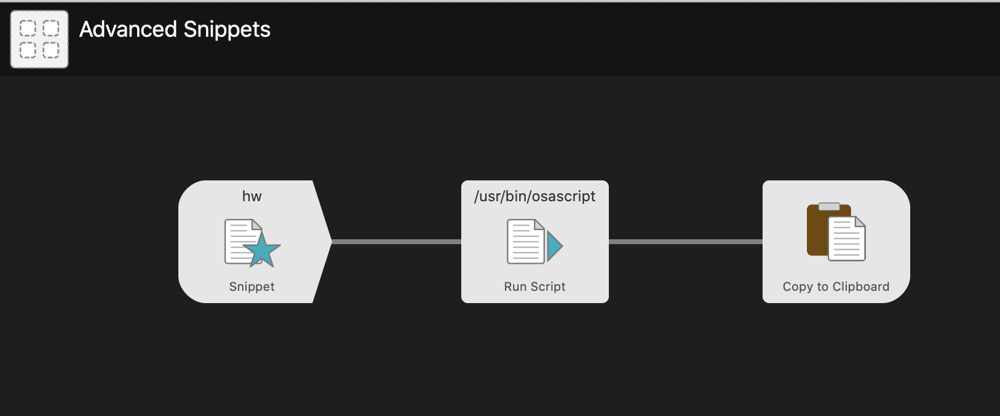
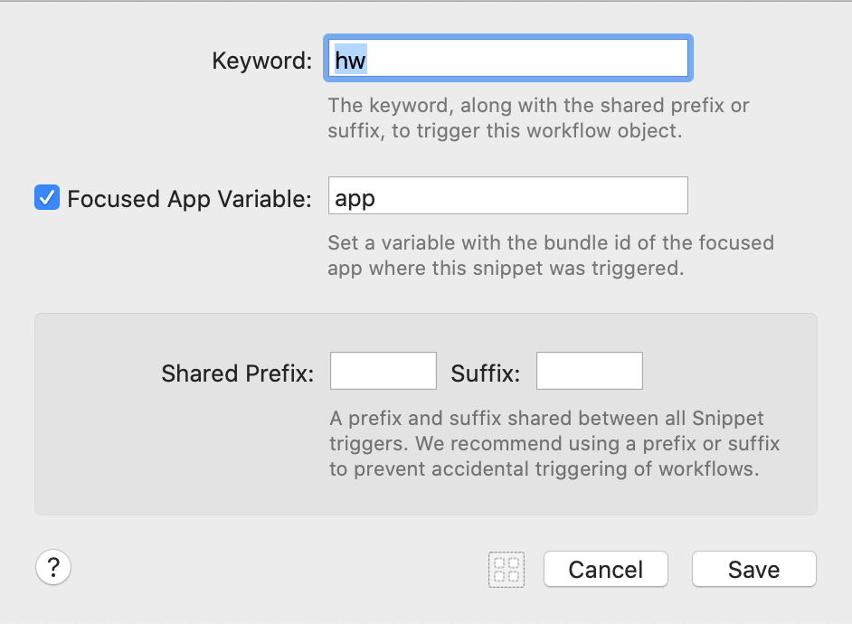
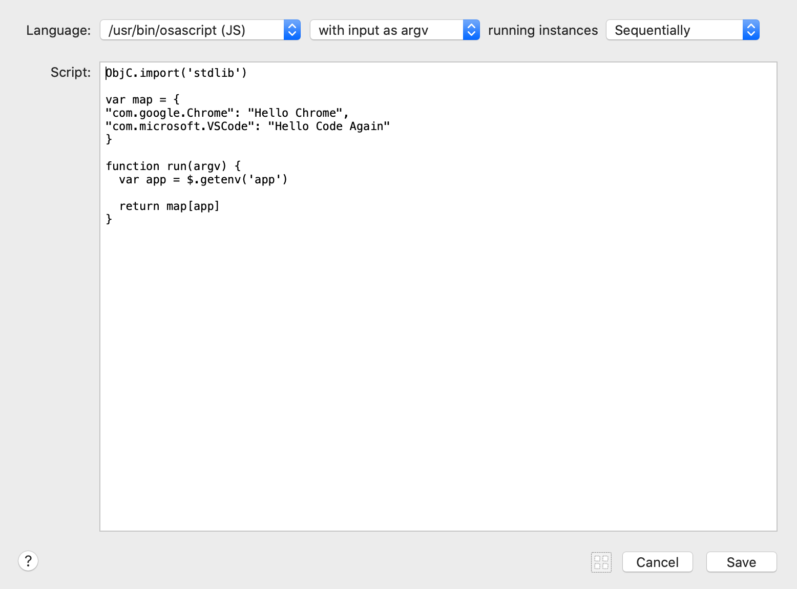
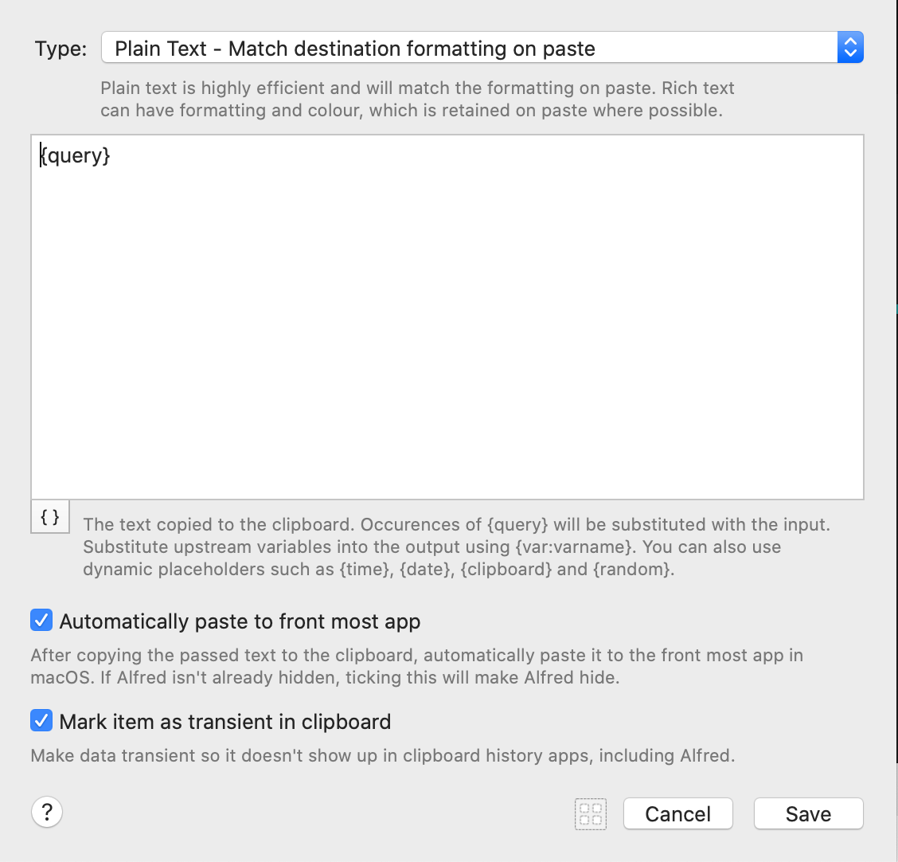

> "It would be very useful if we can use snippet groups only when some specific applications are activated"

> "Is there a way that you could use a workflow to monitor when the specified application is being used and then wait for the keyboard trigger?"

Snippets in [AlfredApp](https://www.alfredapp.com/) are very powerful on their own, but become even more robust when built inside of a workflow. Snippets in workflows allow you to grab the current frontmost "app id" and then you can change the value of what the snippet produces based on that id.

## Creating the Snippet Workflow

Our Snippet workflow will require 3 steps: Listening for the snippet, running a bit of code, and then pasting from the clipboard:



## Configuring Your Snippet

The keyword can be set to whatever you want. For our example, we'll use `hw` (an acronym for "Hello World").

It's necessary to click the checkbox for "Focused App Variable" because we'll be using the app variable to map to the output we want to paste. Give the app variable any name you want. I selected `app` for our use case.



## Mapping Your Frontmost App to a Snippet Output

You can use whatever language you would like to write this script. I chose JavaScript because it's what I use at my job. The key is that you access the focused app variable as describe in this article:

- [How to Add Workflow Environment Variables to Alfred Scripts](https://www.alfredforum.com/topic/9070-how-to-workflowenvironment-variables/).

In our example, we used `ObjC.import('stdlib')` and `$.getenv('app')` to get the value of the `app` variable.

```js
ObjC.import('stdlib')

var map = {
  'com.google.Chrome': 'Hello Chrome',
  'com.microsoft.VSCode': 'Hello Code',
}

function run(argv) {
  var app = $.getenv('app')

  return map[app]
}
```



## Defining the Output of the Snippet

Use the "Copy to Clipboard" with the following settings to simply output the text you mapped in the script. You can customize this template and even make things more advanced, but usually simple, short snippets defined in your Script section will suffice.


