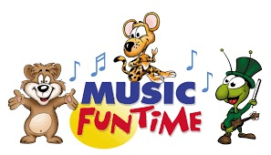

I've been playing around with Music Visualizers in JavaScript. I figured it would be possible to pump music into the background of my OBS to add a bit of flavor to my livestream. The result is below and I'm quite happy with it:

<YoutubeEmbed slug="UhhJQSkGGSM"/>

It's a bit complicated to set up, but if I find the time, I'll write up how it's all put together.